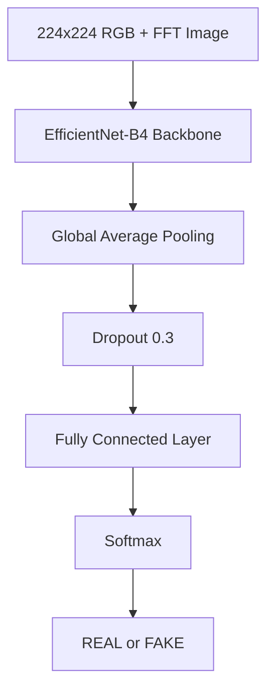
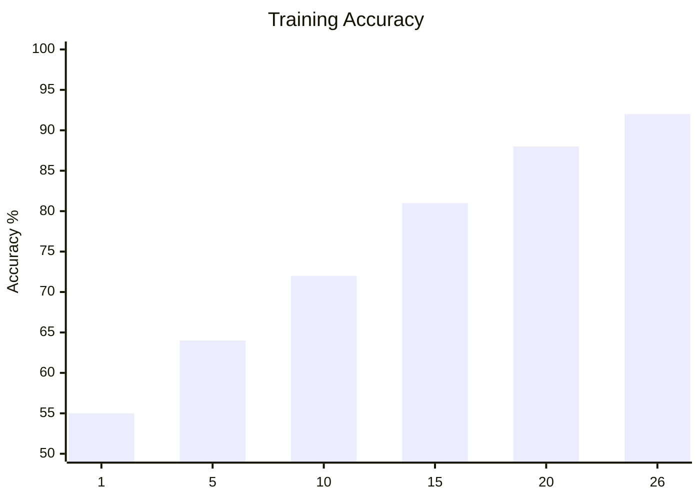

# Deepfake Video Detection using EfficientNet-B4 + FFT

## Project Overview

This project is a Deepfake Video Detection system that combines:

- Face Detection using OpenCV
- FFT (Fast Fourier Transform) Frequency Analysis
- EfficientNet-B4 Deep Learning Model

The system detects whether a video is **REAL** or **FAKE** by analyzing:
- Spatial facial features
- Hidden frequency-domain artifacts generated by deepfake algorithms

---

# Features

- Video frame extraction
- Face detection and cropping
- FFT frequency analysis
- Deep learning classification
- Desktop application support
- 92.33% detection accuracy

---

# Project Pipeline

---

# Model Architecture

---

# Dataset

| Type | Count |
|---|---|
| Real Videos | 363 |
| Fake Videos | 941 |
| Extracted Faces | 7200 |

Dataset Used:
- DFD (Deep Fake Detection)

---

# Training Results

| Metric | Result |
|---|---|
| Accuracy | 92.33% |
| Epochs | 26 |
| Initial Accuracy | 55.66% |

---

# Accuracy Progress

---

# Technologies Used

- Python
- PyTorch
- OpenCV
- NumPy
- EfficientNet-B4
- FFT

---

# Key Idea

Traditional image analysis may fail to detect modern deepfakes.

This project improves detection by combining:
- Spatial image analysis
- Frequency-domain analysis using FFT

FFT reveals hidden manipulation artifacts that are invisible to the human eye.

---

# Future Improvements

- Train on multiple datasets
- Add temporal analysis (LSTM / Transformers)
- Build a web application
- Improve cross-dataset generalization
- Replace EfficientNet with Vision Transformers (ViT)

---

# Authors

- Bashar
- Wadea
- Ahmad

### Institution
Yarmouk University

### Date
May 2026
